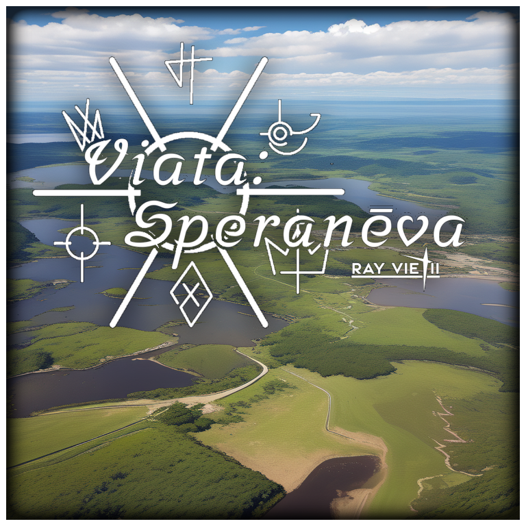
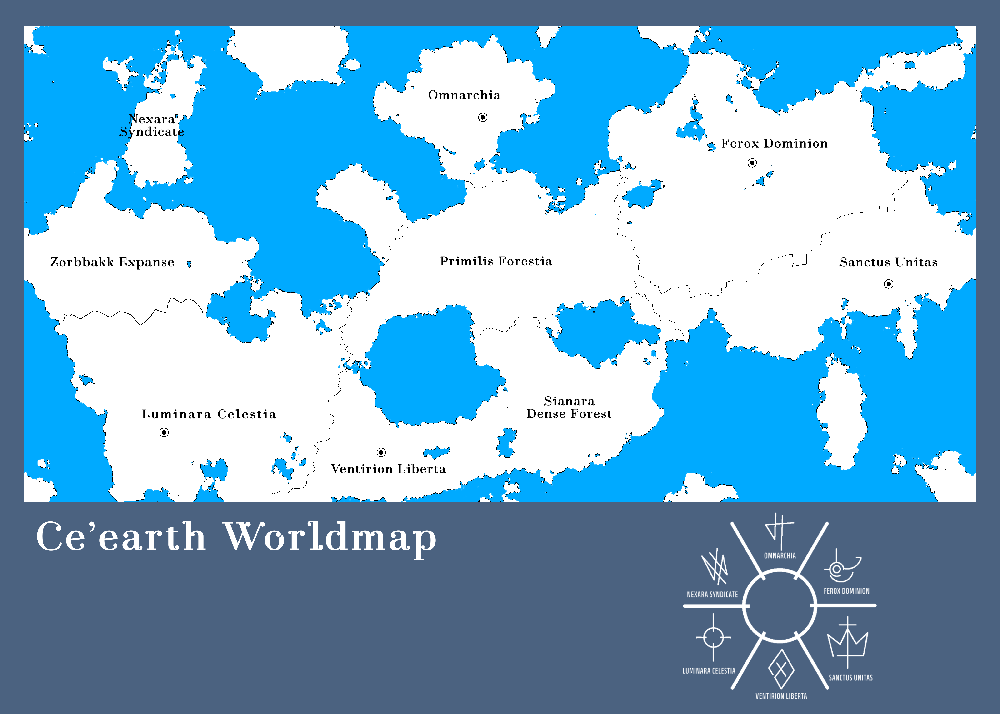

# Speranēva  

_"In the depths of [ ... ]  There is [ ... ]"_  

Speranēva is a Ontological Mythoscience worldbuilding project written and built by Ray Vietii.  
It includes cultures, races, languages, lore, myth, and speculative science.

## Contents
- 📜 Lore Overview
- 🧬 Species Dossiers
- 🗣️ Prinila Langua (Conlang)
- ⚔️ Political Systems & History
- 🌍 Geography & Maps
- Power System

---

# Meta Lore

>It's started with; "before time itself had meaning", followed by "She (Time), weaved the cosmos, and with her divine threads, She, knit together the very fabric of existence". Thus "existence", came first long before "space".
>
>Which then; "From her hands came the four primordial constant of forces: Fate, Space, Manifest, and Nihil."
>
>And "It is Fate who unfolded the space"
>
>Fate is a box, and within (the box), is where free-will operates. >And Destiny is an ultimate end, of everything that existed will come to an end.
>
>It's not "how", it is a "consequence".
